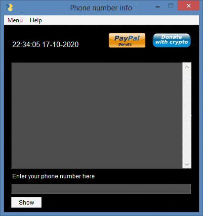

[](https://www.python.org/)


[](https://github.com/adrijano/phone-number-info/)

[](https://github.com/adrijano/phone-number-info/graphs/commit-activity)





[](https://www.paypal.com/donate/?cmd=_s-xclick&hosted_button_id=PFB6A6HLAQHC2&source=url)  [](https://commerce.coinbase.com/checkout/149a6235-ec7e-4d3b-a1ae-b08c4f08b4f6)

# If you like it give it a star

[](https://github.com/adrijano/phone-number-info)

**Programmed in Python | PySimpleGUI**

# How it works
```
Simple program show  carrier, region and  timezone of phone number.

```
# How to use

### Python3+
```
git clone https://github.com/adrijano/phone-number-info.git

cd phone-number-info && pip install -r requirements.txt

python phone.py
```

### Windows
```
cd dist

phone.exe
```
## Donations
If you would like to support me, donations are very welcome.

```
You can use Paypal to donate using your own credit card. 
The payment is processed by PayPal but you don't need to have a
PayPal account or sign-up for one if you are paying by credit card.

You can also use your own Paypal account to donate.

You can also donate Bitcoin, Bitcoin Cash, Dai, Ethereum, Litecoin and USD Coin.
```
[](https://www.paypal.com/donate/?cmd=_s-xclick&hosted_button_id=PFB6A6HLAQHC2&source=url)  [](https://commerce.coinbase.com/checkout/149a6235-ec7e-4d3b-a1ae-b08c4f08b4f6)

[](https://github.com/adrijano/phone-number-info/)


